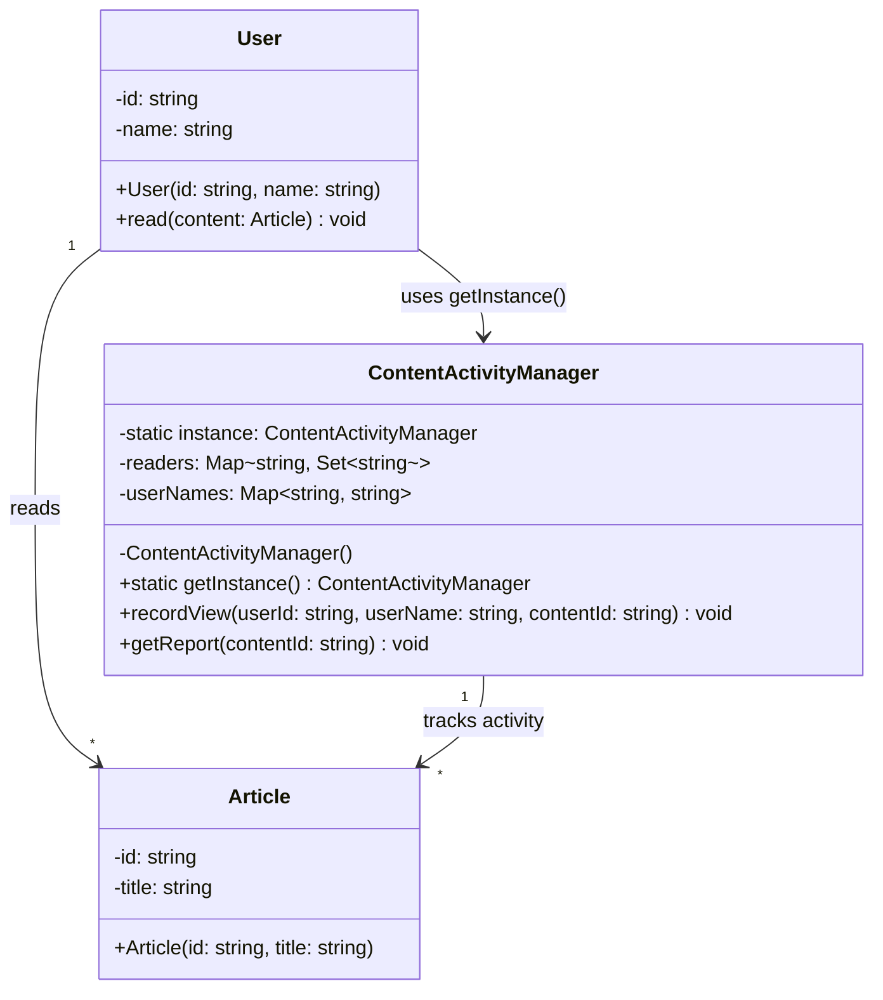

# Singleton Pattern

## Overview
**Singleton Pattern** คือ Creational Design Pattern ที่รับประกันว่าคลาสสามารถมีเพียงอินสแตนซ์เดียวเท่านั้น และจัดเตรียมจุดเข้าถึงแบบโลกบาล (Global Point of Access) เพื่อเข้าถึงมัน

**Use Case:** จัดการทรัพยากรเดียว เช่น บันทึกกิจกรรม (Activity Logger), การเชื่อมต่อฐานข้อมูล, ตั้งค่าระบบ (Configuration)

---

## Mermaid Class Diagram

---

## Component Breakdown

### 🏭 Singleton Component:
- **Singleton Instance:** `ContentActivityManager`
  - จัดการบันทึกกิจกรรมการอ่านบทความในระบบ
  - เก็บข้อมูลผู้อ่าน (readers: Map<contentId, Set<userId>>)
  - เก็บชื่อผู้ใช้ (userNames: Map<userId, userName>)
  - ป้องกันการสร้างอินสแตนซ์ใหม่ด้วย private constructor
  - ให้บริการเข้าถึงผ่าน `static getInstance()`

### 👥 Client Components:
- **User:** ผู้ใช้งาน ทำการอ่าน Article และบันทึกกิจกรรมผ่าน Singleton
- **Article:** บทความที่อ่าน มี id และ title

### 🔗 Relationships:
- `User → ContentActivityManager`: User ขอใช้บริการ Singleton ผ่าน `getInstance()`
- `User → Article`: User อ่านบทความ
- `ContentActivityManager → Article`: Singleton ติดตามกิจกรรมอ่านเกี่ยวกับ Article

---

## Key Benefits
✅ **Single Instance Control:** รับประกันมีเพียงอินสแตนซ์เดียวตลอดวงจรชีวิตแอป  
✅ **Global Access:** เข้าถึงได้จากทั่วทั้งแอปผ่าน `getInstance()`  
✅ **Lazy Initialization:** สร้างเฉพาะเมื่อต้องใช้  
✅ **Resource Efficiency:** ไม่สูญเสียหน่วยความจำจากการสร้างหลายอินสแตนซ์
