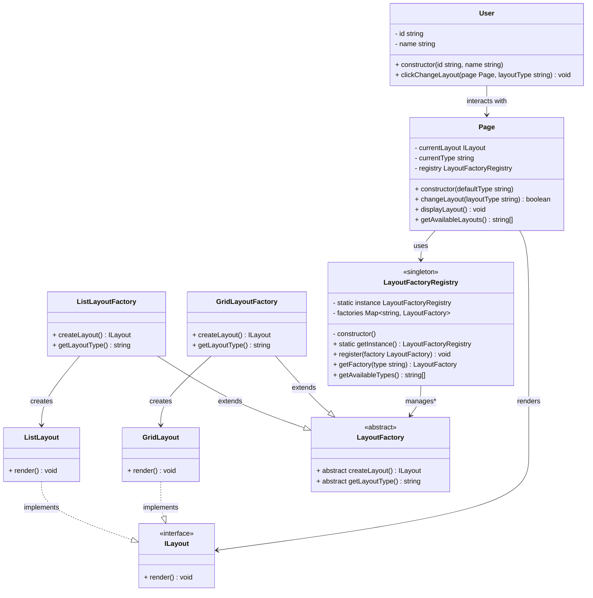
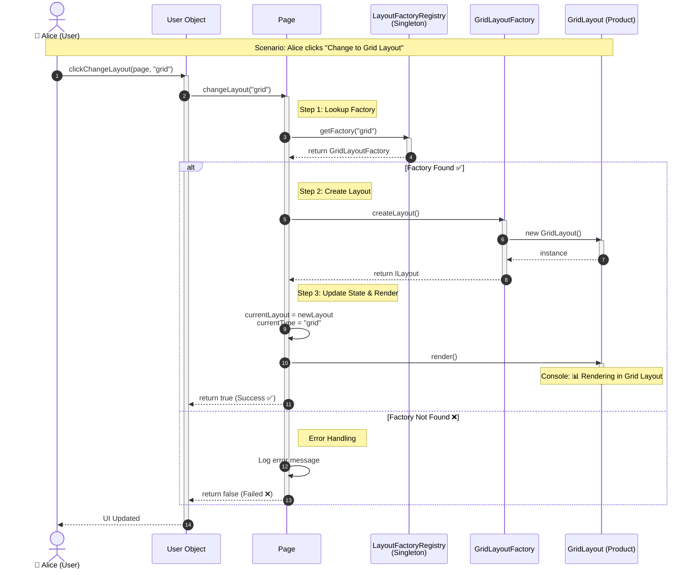
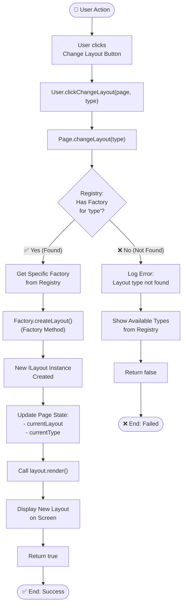

# Factory Method Pattern + Registry Pattern

## 📋 Pattern Overview

**Factory Method** เป็น Creational Design Pattern ที่ใช้ abstract method เพื่อ**สร้างวัตถุโดยไม่ระบุคลาสที่แน่นอน** ปล่อยให้ subclass ตัดสินใจว่าจะสร้างคลาสใด

**Enhanced with Registry Pattern** เพื่อ **จัดการ Factory แบบ Centralized และ Dynamic Registration** ทำให้ Scalable และ Maintainable มากขึ้น

**Real-world Use Case:** ระบบเปลี่ยน Layout หน้าเว็บ (List, Grid, Timeline) โดย:
- Factory Method สร้าง Layout
- Registry เก็บและจัดการ Factory ทั้งหมด
- Page รับผิดชอบ Render และ State
- User ทำ Interaction เท่านั้น

---

## 🎨 Class Diagram



---

## 🏗️ Component Mapping

### Product Layer (สินค้า):
- **Product Interface:** `ILayout`
  - สัญญา `render()` สำหรับทุก Layout
- **Concrete Products:**
  - `ListLayout` - แสดง List Layout (📋)
  - `GridLayout` - แสดง Grid Layout (📊)

### Factory Layer (ผู้สร้าง):
- **Abstract Factory:** `LayoutFactory`
  - `createLayout()` - สร้าง Layout (abstract)
  - `getLayoutType()` - บอก type ของตัวเอง (abstract)
- **Concrete Factories:**
  - `ListLayoutFactory` - สร้าง ListLayout
  - `GridLayoutFactory` - สร้าง GridLayout

### Registry Layer (ทะเบียนกลาง):
- **Singleton Registry:** `LayoutFactoryRegistry`
  - `register()` - ลงทะเบียน Factory
  - `getFactory()` - ค้นหา Factory ด้วย type
  - `getAvailableTypes()` - แสดงรายการ type ทั้งหมด
  - **Pattern:** Singleton (มีแค่ตัวเดียว)

### Application Layer (แอปพลิเคชัน):
- **View/Page:** `Page`
  - เก็บ State: `currentLayout`, `currentType`
  - รับผิดชอบ Render และ State Management
  - ไม่รู้จัก Factory โดยตรง (ใช้ผ่าน Registry)
- **Client:** `User`
  - Interaction เท่านั้น (Click)
  - ส่ง string type ธรรมดา ไม่ต้องรู้จัก Factory

---

## 🔗 Relationships

| Relationship | Description |
|---|---|
| `ListLayout implements ILayout` | Concrete Product ทำตามสัญญา |
| `GridLayout implements ILayout` | Concrete Product ทำตามสัญญา |
| `ListLayoutFactory extends LayoutFactory` | Concrete Factory สำหรับ List |
| `GridLayoutFactory extends LayoutFactory` | Concrete Factory สำหรับ Grid |
| `LayoutFactoryRegistry → LayoutFactory` | Registry เก็บ Factory ทั้งหมด (Composition) |
| `Page → LayoutFactoryRegistry` | Page ใช้ Registry เพื่อหา Factory |
| `Page → ILayout` | Page render Layout ปัจจุบัน |
| `User → Page` | User ส่ง command ไปยัง Page |

---

## ✨ Key Characteristics

✅ **Defers Object Creation:** Factory Method เลื่อนการสร้างไปยัง Subclass  
✅ **Central Registry:** Factory ทั้งหมดอยู่ที่เดียว (Singleton Registry)  
✅ **Loose Coupling:** Page ไม่รู้จัก Factory โดยตรง  
✅ **Dynamic Registration:** Register Factory ได้ตอน Runtime  
✅ **Easy Extension:** เพิ่ม Layout ใหม่แค่ 2 steps (สร้าง + register)  
✅ **O(1) Lookup:** ใช้ Map เร็วกว่า if-else chain  
✅ **Separation of Concerns:** แยกหน้าที่ชัดเจน (Creation / Registry / Render / Interaction)

---

## 🔄 Process Flow

### Sequence Diagram: User Changes Layout



### Flowchart: Layout Change Process



---

## 📋 Implementation Checklist

### Current Implementation Status

#### ✅ Completed Features
- [x] **ILayout Interface** - Product interface definition
- [x] **ListLayout** - List view implementation
- [x] **GridLayout** - Grid view implementation
- [x] **LayoutFactory** - Abstract factory with `createLayout()` and `getLayoutType()`
- [x] **ListLayoutFactory** - Concrete factory for List
- [x] **GridLayoutFactory** - Concrete factory for Grid
- [x] **LayoutFactoryRegistry** - Singleton registry for factory management
- [x] **Page Component** - View layer with state management
- [x] **User Component** - Interaction layer
- [x] **Error Handling** - Handle invalid layout types
- [x] **Dynamic Registration** - Runtime factory registration

#### 🚧 Future Enhancements

##### High Priority
- [ ] **TimelineLayout** - Timeline view (already designed, just need to register)
  ```typescript
  // Step 1: Create Product
  class TimelineLayout implements ILayout {
      render(): void {
          console.log("📅 Rendering in Timeline Layout");
      }
  }
  
  // Step 2: Create Factory
  class TimelineLayoutFactory extends LayoutFactory {
      createLayout(): ILayout { return new TimelineLayout(); }
      getLayoutType(): string { return "timeline"; }
  }
  
  // Step 3: Register (1 line!)
  registry.register(new TimelineLayoutFactory());
  ```

- [ ] **KanbanLayout** - Kanban board view
- [ ] **CalendarLayout** - Calendar view
- [ ] **TableLayout** - Data table view

##### Medium Priority
- [ ] **Layout Transitions** - Smooth animations between layouts
- [ ] **Layout Persistence** - Save user's preferred layout
- [ ] **Layout Customization** - User-defined layout settings
- [ ] **Responsive Layouts** - Auto-switch based on screen size
- [ ] **Layout Preview** - Show thumbnail before switching

##### Low Priority (Advanced)
- [ ] **Custom Layout Builder** - Let users create custom layouts
- [ ] **Layout Templates** - Pre-defined layout configurations
- [ ] **A/B Testing** - Test different layouts for optimization
- [ ] **Layout Analytics** - Track which layouts users prefer
- [ ] **Plugin System** - Third-party layout extensions

---

## 🎯 Best Practices & Tips

### 1. When to Add New Layout

**Before Adding:**
```typescript
// ❌ Don't hard-code everywhere
if (type === "list" || type === "grid" || type === "newLayout") { ... }
```

**Proper Way:**
```typescript
// ✅ Just create Factory + register
class NewLayoutFactory extends LayoutFactory { ... }
registry.register(new NewLayoutFactory());
// Done! ระบบรู้จักอัตโนมัติ
```

---

### 2. Factory Registration Order

```typescript
// ✅ Good: Register in logical order
registry.register(new ListLayoutFactory());     // Basic
registry.register(new GridLayoutFactory());     // Basic
registry.register(new TimelineLayoutFactory()); // Advanced
registry.register(new KanbanLayoutFactory());   // Advanced

// ❌ Avoid: Random order (confusing)
registry.register(new KanbanLayoutFactory());
registry.register(new ListLayoutFactory());
registry.register(new TimelineLayoutFactory());
```

---

### 3. Error Handling Pattern

```typescript
// ✅ Always check return value
const success = page.changeLayout("timeline");
if (!success) {
    // Fallback to default
    page.changeLayout("list");
    // Or show error to user
    console.error("Layout not available");
}

// ❌ Don't ignore errors
page.changeLayout("invalid"); // อาจทำให้ state เสีย
```

---

### 4. Testing New Layouts

```typescript
// ✅ Test all scenarios
console.log("Available:", registry.getAvailableTypes()); // ["list", "grid"]

// Test valid
page.changeLayout("list");   // Should work ✅
page.changeLayout("grid");   // Should work ✅

// Test invalid
page.changeLayout("invalid"); // Should fail gracefully ❌

// Test edge cases
page.changeLayout("");        // Empty string
page.changeLayout(null);      // Null (if possible)
```

---

### 5. Performance Considerations

| Scenario | Performance | Notes |
|---|---|---|
| **Factory Lookup** | O(1) | Map.get() very fast |
| **Layout Creation** | O(1) | Just `new Layout()` |
| **Registry getInstance** | O(1) | Cached singleton |
| **Render** | Depends | Based on Layout complexity |

**Optimization Tips:**
- ✅ Reuse Layout instances if stateless (Flyweight Pattern)
- ✅ Lazy load heavy layouts
- ✅ Cache rendered HTML if applicable

---

### 6. Scalability Roadmap

#### Phase 1: Current (2-3 Layouts) ✅
- List, Grid layouts
- Basic registry system
- Simple state management

#### Phase 2: Growing (4-10 Layouts)
- Add Timeline, Kanban, Calendar
- Layout persistence
- User preferences

#### Phase 3: Large Scale (10+ Layouts)
- Plugin architecture
- Lazy loading
- A/B testing
- Analytics

#### Phase 4: Enterprise (20+ Layouts)
- Custom layout builder
- Third-party integrations
- Advanced theming
- Multi-tenant support

---

## 🚀 Quick Reference

### Add New Layout (2 Steps)

```typescript
// 1️⃣ Create Product & Factory
class MyLayout implements ILayout {
    render(): void { console.log("My Layout!"); }
}

class MyLayoutFactory extends LayoutFactory {
    createLayout(): ILayout { return new MyLayout(); }
    getLayoutType(): string { return "my"; }
}

// 2️⃣ Register
registry.register(new MyLayoutFactory());

// ✅ Done! Use it:
page.changeLayout("my");
```

### Check Available Layouts

```typescript
const available = page.getAvailableLayouts();
console.log(available); // ["list", "grid", "my"]
```

### Safe Layout Change

```typescript
if (!page.changeLayout("newLayout")) {
    page.changeLayout("list"); // Fallback
}
```

---

## 📚 Related Patterns

| Pattern | Usage in This Code | Purpose |
|---|---|---|
| **Factory Method** | `LayoutFactory.createLayout()` | Create layouts |
| **Singleton** | `LayoutFactoryRegistry` | Single registry instance |
| **Registry** | `LayoutFactoryRegistry` | Manage factories |
| **Strategy** | Different Layout rendering | Swap algorithms |

---

## 💡 Key Takeaways

1. **Factory Method** = Create objects without specifying exact class
2. **Registry Pattern** = Central place to manage all factories
3. **Separation of Concerns** = Factory/Registry/Page/User have clear roles
4. **Scalability** = Add new layouts without modifying existing code
5. **Open-Closed Principle** = Open for extension, closed for modification

**Remember:** เพิ่ม Layout ใหม่ = สร้าง Factory + Register แค่นั้น! 🎉

## Knowledge & Experience 

1. Layout State Management (ขั้นสูง)
เพิ่ม state ของ Layout เช่น:

```ts
interface LayoutState {
    sortBy?: string;
    filterBy?: string;
    columns?: number; // สำหรับ Grid
}

class Page {
    private layoutStates: Map<string, LayoutState> = new Map();
    
    changeLayout(type: string, state?: LayoutState) {
        // เก็บ state เฉพาะแต่ละ layout
        if (state) this.layoutStates.set(type, state);
    }
}
```

2. Layout Composition Pattern
สร้าง Complex Layout จาก Layout เล็กๆ:

```ts
class CompositeLayout implements ILayout {
    private layouts: ILayout[] = [];
    
    add(layout: ILayout) { this.layouts.push(layout); }
    
    render() {
        this.layouts.forEach(l => l.render());
    }
}
```

3. Layout Middleware (เหมือน Express.js)

```ts
type LayoutMiddleware = (layout: ILayout, next: () => void) => void;

class Page {
    private middlewares: LayoutMiddleware[] = [];
    
    use(middleware: LayoutMiddleware) {
        this.middlewares.push(middleware);
    }
    
    changeLayout(type: string) {
        // Run middlewares: logging, analytics, validation
        this.runMiddlewares(layout);
    }
}
```

4. Layout Metadata System

```ts
interface LayoutMetadata {
    name: string;
    description: string;
    icon: string;
    tags: string[];
    minWidth?: number; // Responsive
}

class LayoutFactory {
    abstract getMetadata(): LayoutMetadata;
}
```

5. Layout Undo/Redo (Command Pattern)

```ts
class LayoutCommand {
    constructor(
        private page: Page,
        private oldType: string,
        private newType: string
    ) {}
    
    execute() { this.page.changeLayout(this.newType); }
    undo() { this.page.changeLayout(this.oldType); }
}

// History stack
const history: LayoutCommand[] = [];
```

6. Performance: Layout Pooling

```ts
class LayoutPool {
    private pool: Map<string, ILayout[]> = new Map();
    
    acquire(type: string): ILayout {
        // Reuse existing layout (if stateless)
        return this.pool.get(type)?.pop() ?? factory.createLayout();
    }
    
    release(type: string, layout: ILayout) {
        // Return to pool for reuse
        this.pool.get(type)?.push(layout);
    }
}
```