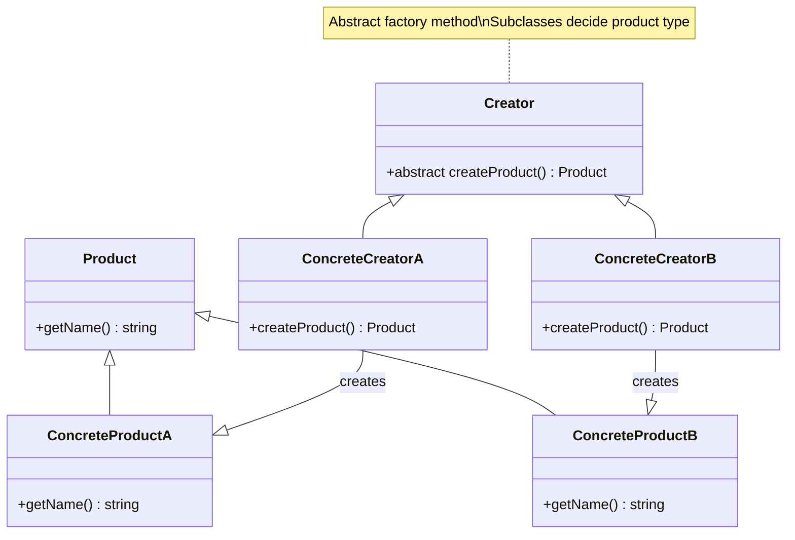

# Factory Method Pattern - Class Diagram

## Description
- **Product**: Interface/Abstract class ที่ define contract สำหรับ products
- **ConcreteProducts**: Classes ที่ implement product interface
- **Creator**: Abstract class ที่มี abstract factory method
- **ConcreteCreators**: Classes ที่ implement factory method สำหรับแต่ละ product type
