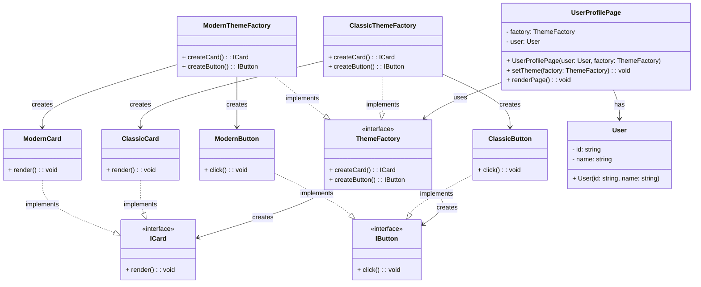

# Abstract Factory Pattern - Class Diagram

## 📋 Pattern Overview

**Abstract Factory** เป็น Creational Design Pattern ที่มีวัตถุประสงค์ให้**สร้างตระกูล (Family) ของวัตถุที่เกี่ยวข้องกัน** โดยไม่ระบุคลาสที่แน่นอน รับประกันความ Consistency ระหว่างสินค้าในตระกูลเดียวกัน

**Real-world Use Case:** ระบบ Theme (Modern vs Classic) - Card และ Button ต้องเป็น Theme เดียวกัน (ไม่ผสมสไตล์)

---

## 🎨 Class Diagram

---

## 🏗️ Component Mapping

### Abstract Products (สินค้าทั่วไป):
- **Abstract Product 1:** `ICard`
  - สัญญา `render()` สำหรับทุก Card
- **Abstract Product 2:** `IButton`
  - สัญญา `click()` สำหรับทุก Button

### Concrete Products - Modern Family:
- **Concrete Product:** `ModernCard`
  - การแสดงผล: Rounded Corners (มุมโค้ง)
- **Concrete Product:** `ModernButton`
  - พฤติกรรม: Ripple Effect

### Concrete Products - Classic Family:
- **Concrete Product:** `ClassicCard`
  - การแสดงผล: Border (กรอบขอบ)
- **Concrete Product:** `ClassicButton`
  - พฤติกรรม: Simple Click

### Abstract Factory:
- **Abstract Factory:** `ThemeFactory`
  - วิธี `createCard()` - สร้าง Card
  - วิธี `createButton()` - สร้าง Button
  - รับประกัน: ทั้ง Card และ Button เป็น Theme เดียวกัน

### Concrete Factories:
- **Concrete Factory 1:** `ModernThemeFactory`
  - สร้าง Modern Card + Modern Button
- **Concrete Factory 2:** `ClassicThemeFactory`
  - สร้าง Classic Card + Classic Button

### Client:
- **UserProfilePage:** จัดการการแสดงผล Profile
  - เลือก Factory -> สร้างสินค้า -> แสดงผล
  - เปลี่ยน Theme ได้ตลอดเวลา (Runtime Switching)

---

## 🔗 Relationships

| Relationship | Description |
|---|---|
| `ThemeFactory → ICard, IButton` | Abstract Factory สร้างตระกูลสินค้า |
| `ModernThemeFactory implements ThemeFactory` | Concrete Factory สำหรับ Modern Theme |
| `ClassicThemeFactory implements ThemeFactory` | Concrete Factory สำหรับ Classic Theme |
| `ModernCard/Button implements ICard/IButton` | Concrete Products ของ Modern |
| `ClassicCard/Button implements ICard/IButton` | Concrete Products ของ Classic |
| `UserProfilePage → ThemeFactory` | Client เลือก Factory เพื่อสร้างสินค้า |

---

## ✨ Key Characteristics

✅ **Family Consistency:** สินค้าในตระกูลเดียวกันจะสอดประสานกัน (Modern Card + Modern Button เสมอ)  
✅ **Easy Theme Switching:** เปลี่ยน Theme ได้ง่าย โดยสลับ Factory  
✅ **Encapsulation:** Client ไม่รู้รายละเอียดของการสร้างสินค้า  
✅ **Scalability:** เพิ่ม Theme ใหม่ได้ง่าย เพียงสร้าง Concrete Factory และ Products ใหม่

