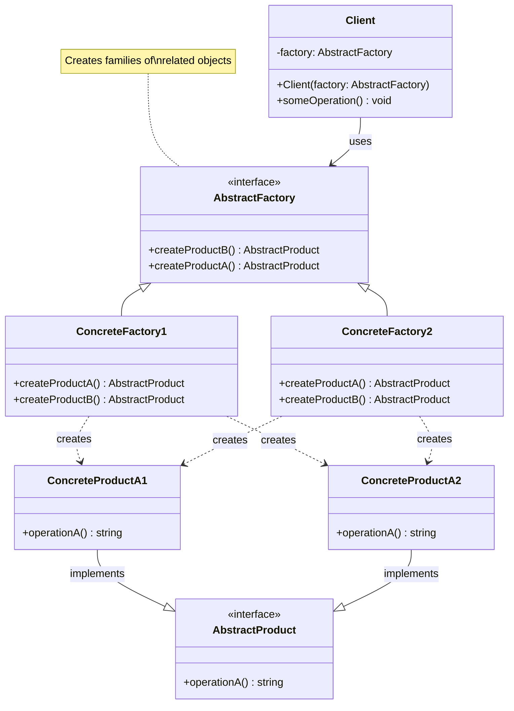

# Abstract Factory Pattern - Class Diagram



## Description
- **AbstractProduct**: Base interfaces/classes สำหรับ product families
- **ConcreteProducts**: Concrete implementations ของแต่ละ product type
- **AbstractFactory**: Interface ที่ define factory methods สำหรับ product family
- **ConcreteFactories**: Implementations ของ AbstractFactory ที่สร้าง related products
- **Client**: ใช้ AbstractFactory เพื่อสร้าง products โดยไม่ผูกมัดกับ concrete classes

```ts
createProductA(): AbstractProduct {
    return new ConcreteProductA1();
}
someOperation(): void {
    const productA: AbstractProduct = this.factory.createProductA();
    productA.operationA();
}
```