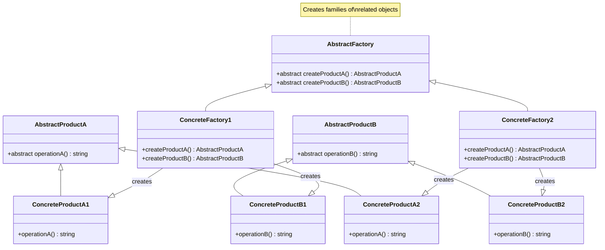

# Abstract Factory Pattern - Class Diagram

## Description
- **AbstractProductA/B**: Base interfaces/classes สำหรับ product families
- **ConcreteProducts**: Concrete implementations ของแต่ละ product type
- **AbstractFactory**: Interface ที่ define factory methods สำหรับ product family
- **ConcreteFactories**: Implementations ของ AbstractFactory ที่สร้าง related products
