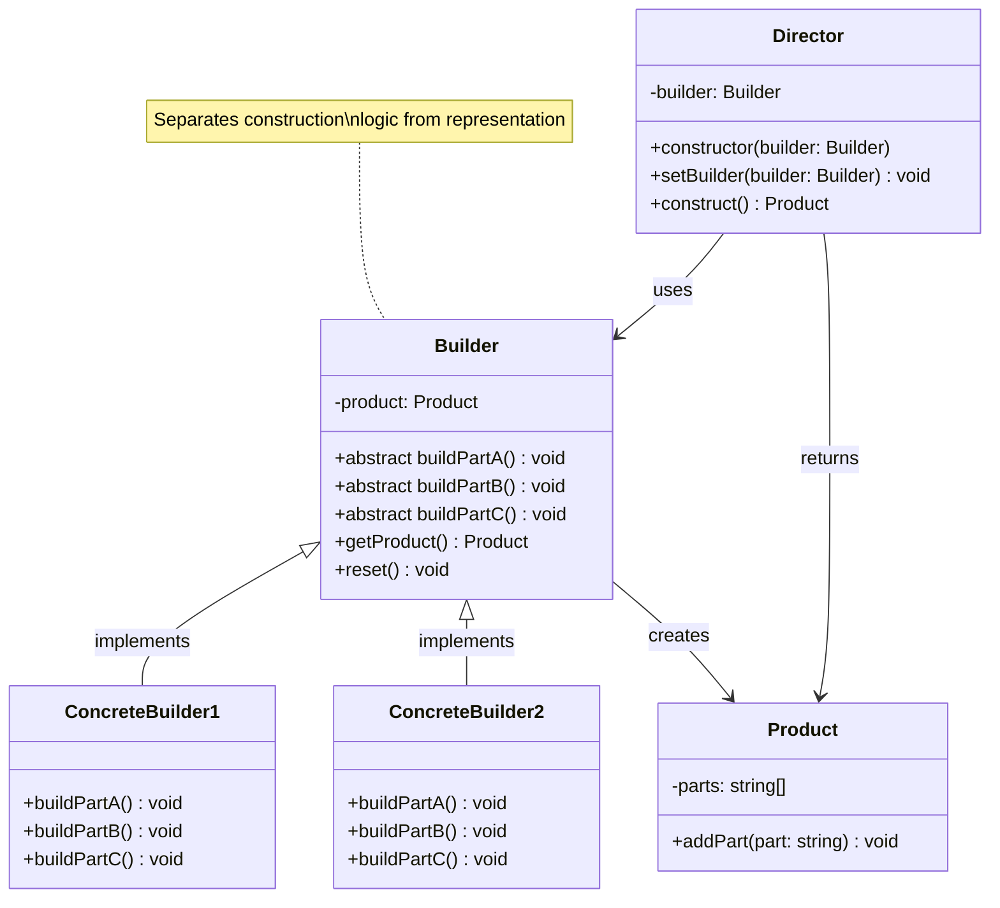

# Builder Pattern - Class Diagram

## Description
- **Product**: Object ที่ต้องสร้างขึ้น
- **Builder**: Abstract class ที่ define step-by-step building methods **Contain Process of Building**
- **ConcreteBuilders**: Implementations ของ Builder ที่สร้าง products ด้วยวิธีต่างกัน
- **Director**: Orchestrates building process ในลำดับที่ถูกต้อง
