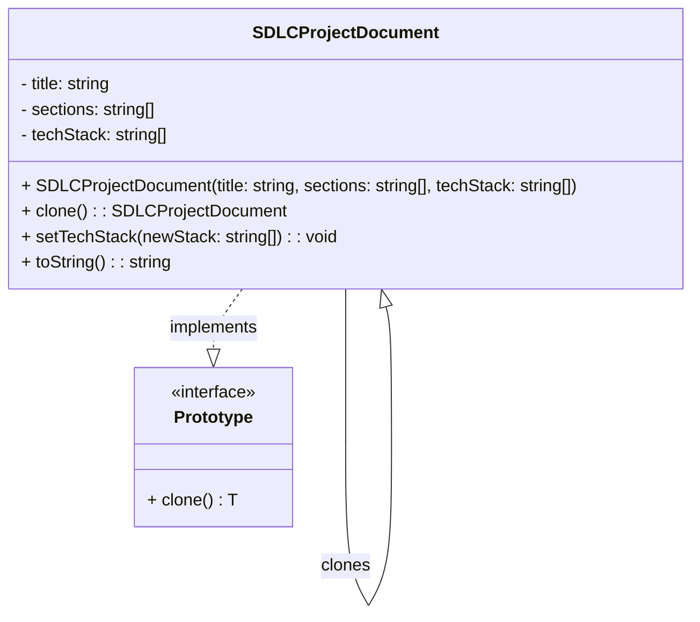

# Prototype Pattern - Class Diagram

## 📋 Pattern Overview

**Prototype** เป็น Creational Design Pattern ที่ใช้ **Clone (คัดลอก) วัตถุที่มีอยู่แล้ว** แทนการสร้างใหม่ตั้งแต่ต้น มีประโยชน์เมื่อการสร้างใหม่มีค่าใช้จ่ายสูง (เช่น โหลดจากฐานข้อมูล)

**Real-world Use Case:** คัดลอกเอกสารโปรเจกต์มาตรฐาน (Template) แล้วปรับปรุงข้อมูลเฉพาะ (เช่น เปลี่ยน Tech Stack) - รวดเร็วกว่าการสร้างใหม่

---

## 🎨 Class Diagram



---

## 🏗️ Component Mapping

### Prototype Interface:
- **Prototype Interface:** `Prototype<T>`
  - กำหนดสัญญา Generic Interface
  - เมธอด `clone(): T` - คืนสำเนาของตัวเอง

### Concrete Prototype:
- **Concrete Prototype:** `SDLCProjectDocument`
  - implement Interface `Prototype<SDLCProjectDocument>`
  - **Data Structure:**
    - `title: string` - ชื่อเอกสาร
    - `sections: string[]` - ส่วนต่างๆ ของเอกสาร
    - `techStack: string[]` - เทคโนโลยีที่ใช้
  - **Constructor:** ตั้งค่าข้อมูลทั้งหมด (Operation ที่มีค่าใช้จ่ายสูง)
  - **clone() Method:**
    - ทำการ Deep Copy (คัดลอกลึก) เพื่อไม่ให้ Reference ชนกัน
    - สร้าง instance ใหม่ด้วยข้อมูลที่คัดลอก
  - **setTechStack():** เปลี่ยน Tech Stack หลังจากคัดลอก
  - **toString():** แสดงข้อมูลเอกสาร

### Client (ผู้ใช้):
- สร้าง Master Template เครื่องแรก (Costly Operation)
- Clone Template เมื่อต้องการใช้ (Efficient Operation)
- ปรับปรุงข้อมูลต่างๆ ในสำเนา

---

## 🔗 Relationships

| Relationship | Description |
|---|---|
| `SDLCProjectDocument implements Prototype` | Concrete Prototype ทำตามสัญญา |
| `SDLCProjectDocument → SDLCProjectDocument` | Self-reference: สร้างสำเนา (Clone) ของตัวเอง |

---

## 💡 Deep Copy vs Shallow Copy

```typescript
// ❌ Shallow Copy (ผิด - Reference ยังชี้ไปเดียวกัน):
const clone1 = Object.assign({}, original);  // Array ยังชี้เดิม
clone1.sections = original.sections;        // ทำให้ทั้งสองเปลี่ยนไป!

// ✅ Deep Copy (ถูก - แยกกันไปแต่ละตัว):
const clonedSections = [...sections];       // Spread operator สำหรับ Array
const clonedTechStack = [...techStack];     // แยกข้อมูลออกมา
```

---

## ✨ Key Characteristics

✅ **Avoid Costly Initialization:** Clone มีค่าใช้จ่ายต่ำกว่าการสร้าง instance ใหม่  
✅ **Deep Copy Implementation:** ใช้ Deep Copy เพื่อไม่ให้ข้อมูลภายในซ้ำซ้อน  
✅ **Independent Instances:** แต่ละ Clone เป็นอิสระ การเปลี่ยนแปลงอันหนึ่งไม่ส่งผลต่อแบบต้นฉบับ  
✅ **Flexible Modification:** Clone แล้วปรับปรุงข้อมูลตามต้องการ  
✅ **Template Pattern:** ใช้เป็น Template สำหรับการสร้างวัตถุที่คล้ายกัน

