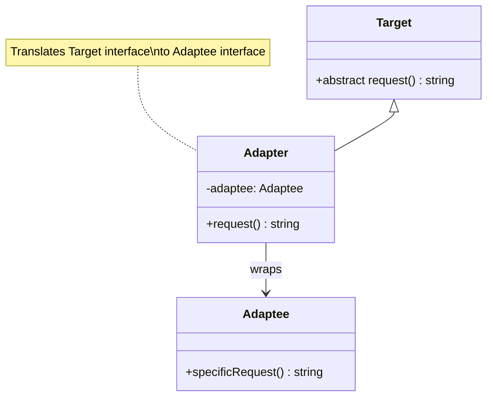

# Adapter Pattern - Class Diagram

## Description
- **Target**: Interface ที่ client ต้องการใช้
- **Adaptee**: Class ที่มี incompatible interface
- **Adapter**: Class ที่ implement Target interface และ wrap Adaptee
- ทำให้ Adaptee สามารถทำงานกับ client ที่คาดหวัง Target interface
