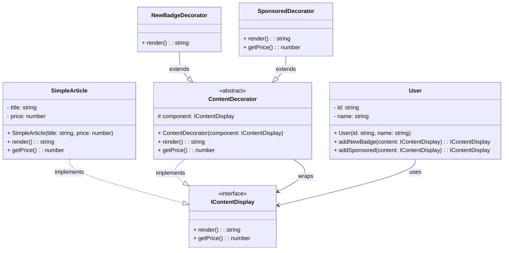

# Decorator Pattern - Class Diagram

## 📋 Pattern Overview

**Decorator** เป็น Structural Design Pattern ที่ **เพิ่มความสามารถให้กับวัตถุอยู่ได้ตลอดเวลา (Runtime) โดยการห่อหุ้ม** ช่วยให้เพิ่มพฤติกรรมเดิมโดยไม่ต้องสร้าง Subclass ใหม่

**Real-world Use Case:** บทความสามารถถูกแปะป้าย [NEW!] และ [SPONSORED] ได้ตามต้องการ โดยไม่สร้าง Subclass ใหม่

---

## 🎨 Class Diagram



---

## 🏗️ Component Mapping

### Component Interface (สัญญาหลัก):
- **IContentDisplay**
  - `render()` - แสดงผล
  - `getPrice()` - ราคา

### Concrete Component (เนื้อหาหลัก):
- **SimpleArticle**
  - บทความปกติ มี title และ price
  - ไม่มี badge ใดๆ

### Base Decorator (ตัวห่อหุ้มพื้นฐาน):
- **ContentDecorator**
  - abstract class ที่ implements `IContentDisplay`
  - ถือ Component (`IContentDisplay`) ไว้เป็น protected
  - ทั้ง render() และ getPrice() เรียกต่อให้ component

### Concrete Decorators (ตัวเพิ่มฟีเจอร์จริง):
- **NewBadgeDecorator**
  - extends `ContentDecorator`
  - override `render()` เพิ่ม "[NEW!]" ข้างหน้า
- **SponsoredDecorator**
  - extends `ContentDecorator`
  - override `render()` เพิ่ม "[SPONSORED]" ข้างหน้า
  - override `getPrice()` เพิ่มค่า 100 (ค่า advertising)

### Client (ผู้ใช้):
- **User**
  - เรียกใช้ `addNewBadge()` และ `addSponsored()` เพื่อห่อหุ้ม

---

## 🔗 Relationships

| Relationship | Description |
|---|---|
| `SimpleArticle implements IContentDisplay` | Concrete Component ทำตามสัญญา |
| `ContentDecorator implements IContentDisplay` | Decorator ทำตามสัญญาเดียวกับ Component |
| `ContentDecorator → IContentDisplay` | Decorator "ถือ" Component ไว้ข้างใน (Composition) |
| `NewBadgeDecorator extends ContentDecorator` | Concrete Decorator ขยาย Decorator พื้นฐาน |
| `SponsoredDecorator extends ContentDecorator` | Concrete Decorator ขยาย Decorator พื้นฐาน |

---

## 💡 Stacking Example

```
┌─────────────────────────────────────┐
│ SponsoredDecorator                  │
│ └─ ContentDecorator                 │
│    └─ NewBadgeDecorator             │
│       └─ ContentDecorator           │
│          └─ SimpleArticle           │
└─────────────────────────────────────┘

Result: [SPONSORED] [NEW!] Article: Design Patterns 101
```

---

## ✨ Key Characteristics

✅ **Runtime Modification:** เพิ่ม/ลบคุณสมบัติได้ตลอดเวลา  
✅ **Single Responsibility:** Decorator แต่ละตัวรับผิดชอบเพิ่มฟีเจอร์เดียว  
✅ **Stacking/Nesting:** สามารถห่อหุ้มได้หลายชั้นตามต้องการ  
✅ **Flexible:** ไม่ต้องสร้าง Subclass เพื่อแต่ละการรวมกัน  
✅ **Open-Closed Principle:** สามารถเพิ่ม Decorator ใหม่โดยไม่แก้เก่า

