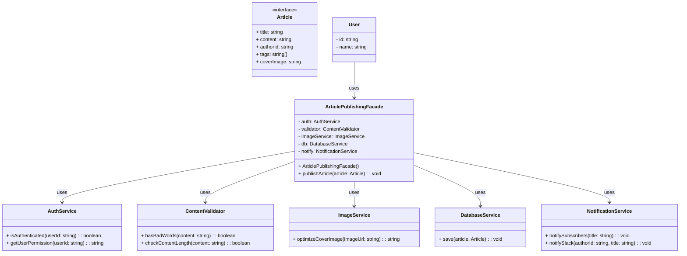

# Facade Pattern - Class Diagram

## 📋 Pattern Overview

**Facade** เป็น Structural Design Pattern ที่มีวัตถุประสงค์ **ให้ Unified Interface ที่เรียบง่าย สำหรับระบบย่อย (Subsystems) ที่ซับซ้อนมากมาย** ซ่อนความเซียนซับในการทำงาน

**Real-world Use Case:** ระบบเผยแพร่บทความ - Authentication, Validation, Image Processing, Database, Notification ทำงานหลังบ้าน แต่ Client เรียกแค่ `publishArticle()` เดียว

---

## 🎨 Class Diagram



---

## 🏗️ Component Mapping

### Subsystems (ระบบย่อยที่ซับซ้อน):
- **AuthService**
  - ตรวจสอบการพิสูจน์ตัวตน
  - ยืนยันสิทธิ์
- **ContentValidator**
  - สแกนคำไม่ดี
  - ตรวจสอบความยาว
- **ImageService**
  - ปรับปรุง Cover Image
- **DatabaseService**
  - บันทึกลงฐานข้อมูล
- **NotificationService**
  - แจ้งเตือนสมาชิก
  - ส่งข้อความ Slack

### Facade (ตัวแม่):
- **ArticlePublishingFacade**
  - ถือ Reference ของระบบย่อยทั้งหมด
  - `publishArticle()` - method เดียวสำหรับ Client เรียก
  - ภายในประสานงาน 5+ subsystem ตามลำดับ

### Client (ผู้ใช้):
- **User** เรียก Facade แทนการเรียก Subsystem โดยตรง

---

## 🔗 Relationships

| Relationship | Description |
|---|---|
| `ArticlePublishingFacade → AuthService` | Facade ประสานกับ Auth ระบบ |
| `ArticlePublishingFacade → ContentValidator` | Facade ประสานกับ Validator |
| `ArticlePublishingFacade → ImageService` | Facade ประสานกับ Image Processing |
| `ArticlePublishingFacade → DatabaseService` | Facade บันทึกข้อมูล |
| `ArticlePublishingFacade → NotificationService` | Facade ส่งแจ้งเตือน |
| `User → ArticlePublishingFacade` | Client ใช้ Facade เท่านั้น ไม่รู้ Subsystems |

---

## 💡 Workflow Sequence

```
Client calls: publishArticle(article)
    ↓
Facade.publishArticle():
    Step 1: auth.isAuthenticated()
    Step 2: auth.getUserPermission()
    Step 3: validator.hasBadWords()
    Step 4: validator.checkContentLength()
    Step 5: imageService.optimizeCoverImage()
    Step 6: db.save(article)
    Step 7: notify.notifySubscribers()
    Step 8: notify.notifySlack()
    ↓
Return Success ✅
```

---

## ✨ Key Characteristics

✅ **Simplified Interface:** Client เห็นเพียง 1 method แทน 5+ subsystems  
✅ **Centralized Logic:** ลำดับการทำงานจัดการในจุดเดียว  
✅ **Decoupled:** Client ไม่ต้องรู้ Subsystem มีอะไรบ้าง  
✅ **Easy to Maintain:** เพิ่ม/เปลี่ยน Subsystem ทำได้ในจุดเดียว  
✅ **Reduced Complexity:** ซ่อนความซับซ้อนจากภายนอก

