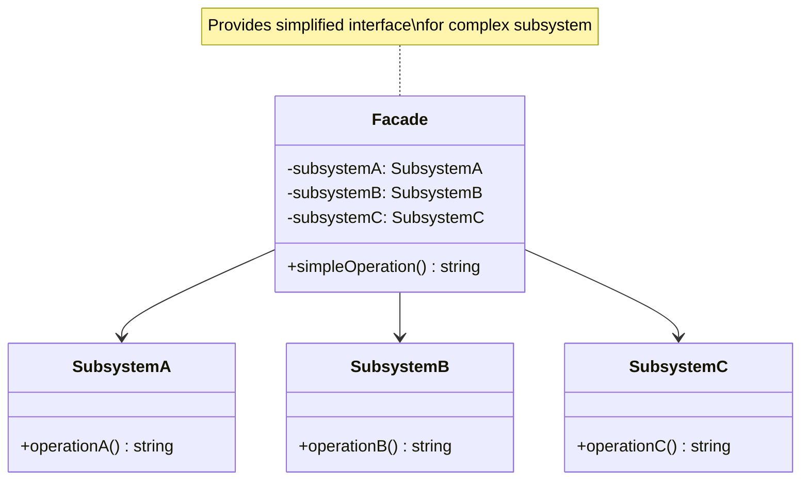

# Facade Pattern - Class Diagram

## Description
- **Facade**: Class ที่ provide simplified interface
- **Subsystem Classes**: Complex classes ที่อยู่เบื้องหลัง facade
- Facade รวม multiple subsystems เข้ามา และ provide simple operations
- Client ใช้ Facade แทนที่จะเข้าถึง subsystems โดยตรง
