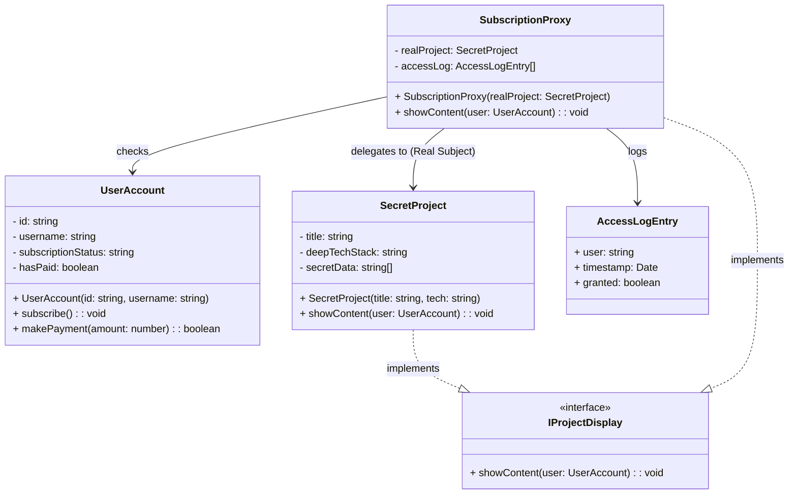

# Proxy Pattern - Class Diagram

## 📋 Pattern Overview

**Proxy** เป็น Structural Design Pattern ที่ **ให้ Surrogate (ตัวแทน) หรือ Placeholder สำหรับอีกวัตถุหนึ่ง** เพื่อควบคุมการเข้าถึง เช่น ตรวจสอบสิทธิ์, Lazy Loading, หรือ Logging

**Real-world Use Case:** ระบบ Paywall - ก่อนให้เข้าเนื้อหา Premium ต้องตรวจสอบว่า User ชำระเงินแล้วหรือยัง

---

## 🎨 Class Diagram



---

## 🏗️ Component Mapping

### Subject Interface (สัญญารวม):
- **IProjectDisplay**
  - `showContent(user)` - แสดงเนื้อหา

### Real Subject (เนื้อหาจริง):
- **SecretProject**
  - implements `IProjectDisplay`
  - เก็บ: title, deepTechStack, secretData
  - `showContent()` แสดงข้อมูล Premium ทั้งหมด
  - **ไม่สนใจเรื่องเงิน - หน้าที่คือแสดงผลเท่านั้น**

### Proxy (ตัวแทนที่คุมประตู):
- **SubscriptionProxy**
  - implements `IProjectDisplay`
  - ถือ Reference ของ `SecretProject` (Real Subject)
  - `showContent()` ตรวจสอบสิทธิ์ก่อน:
    - ถ้า `hasPaid = true` → เรียก `realProject.showContent()`
    - ถ้าไม่ → ปฏิเสธการเข้าถึง
  - เก็บ `accessLog` เพื่อติดตามใครเข้าถึง

### Context Objects:
- **UserAccount**
  - เก็บข้อมูลสมาชิก, สถานะ subscription, สถานะการจ่ายเงิน
  - `subscribe()` - ลงทะเบียน
  - `makePayment()` - ชำระเงิน

---

## 🔗 Relationships

| Relationship | Description |
|---|---|
| `SecretProject implements IProjectDisplay` | Real Subject ทำตามสัญญา |
| `SubscriptionProxy implements IProjectDisplay` | Proxy ทำตามสัญญาเดียวกัน |
| `SubscriptionProxy → SecretProject` | Proxy "ถือ" Real Subject (Delegation) |
| `SubscriptionProxy → UserAccount` | Proxy ตรวจสอบสถานะ User |

---

## 💡 Access Control Workflow

```
Client calls: proxy.showContent(user)
    ↓
Proxy checks:
    ├─ Is user authenticated? ✓
    ├─ Does user have premium subscription? ✓
    └─ Has user paid? 
        ├─ Yes (hasPaid = true)
        │   ↓ Delegate to Real Subject
        │   realProject.showContent(user)
        │   ↓
        │   Display SECRET DATA ✅
        │
        └─ No (hasPaid = false)
            ↓ Deny Access
            Show Error Message ❌
```

---

## 🏷️ Proxy Types

| Type | Purpose | Example |
|---|---|---|
| **Protection Proxy** | Control access based on permissions | SubscriptionProxy (checks hasPaid) |
| **Virtual Proxy** | Lazy loading heavy objects | Load image only when needed |
| **Caching Proxy** | Cache results for performance | Cache API responses |
| **Logging Proxy** | Log all access attempts | accessLog in SubscriptionProxy |

---

## ✨ Key Characteristics

✅ **Access Control:** ตรวจสอบสิทธิ์ก่อนให้เข้าถึง Real Subject  
✅ **Lazy Loading:** สร้าง Real Subject เมื่อจำเป็นเท่านั้น  
✅ **Logging:** ติดตามใครเข้าถึง (AccessLog)  
✅ **Same Interface:** Client ไม่รู้ว่าใช้ Proxy หรือ Real Subject  
✅ **Protection:** ป้องกันการเข้าถึงโดยอนุญาต

