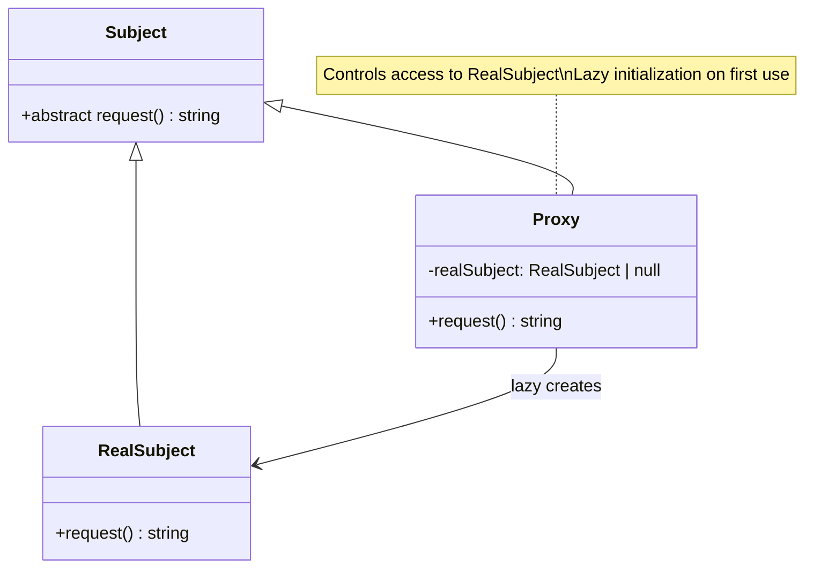

# Proxy Pattern - Class Diagram

## Description
- **Subject**: Interface ที่ define common operations
- **RealSubject**: Actual object ที่ต้องการ protect หรือ lazy load
- **Proxy**: Class ที่ implement subject interface และ control access
- Proxy อาจ lazy initialize RealSubject หรือ add access control
