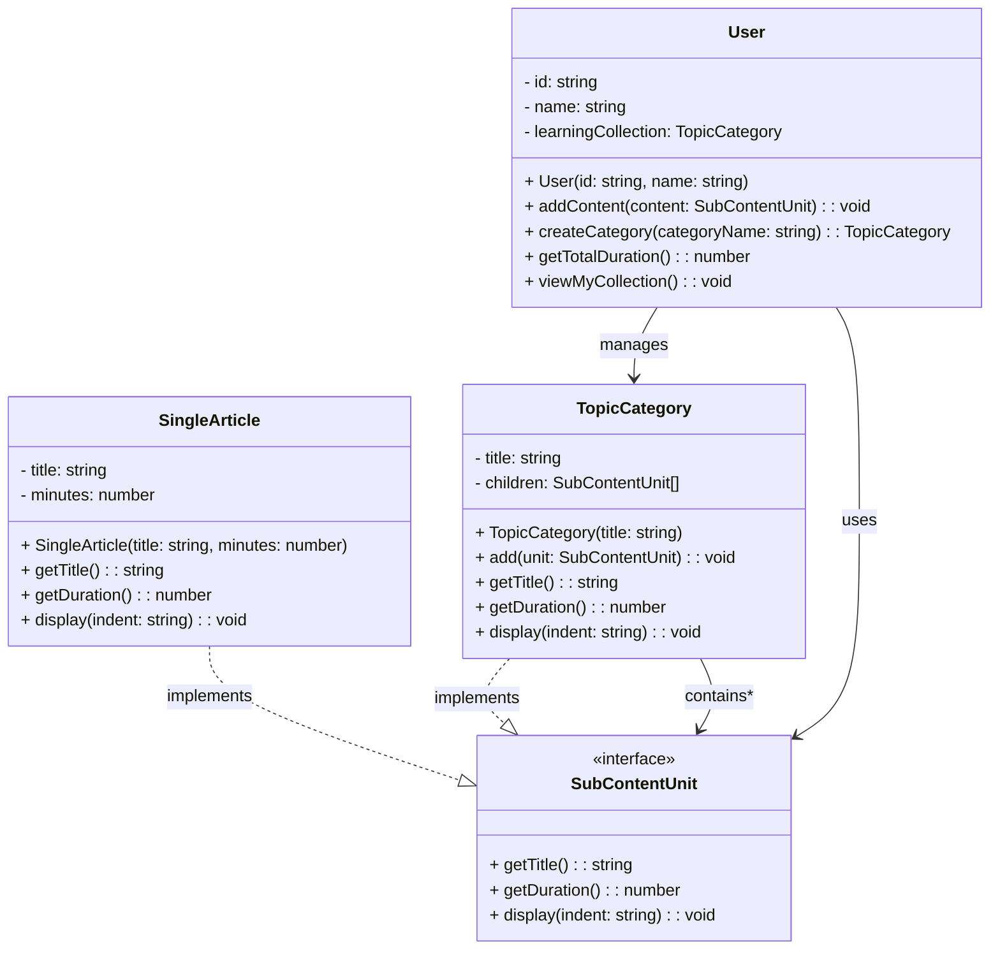

# Composite Pattern - Class Diagram

## 📋 Pattern Overview

**Composite** เป็น Structural Design Pattern ที่ **รวมวัตถุเข้าไปในโครงสร้างแบบต้นไม้ (Tree Structure) สำหรับแสดงส่วนและส่วนรวม** ให้ Client สามารถจัดการกับวัตถุเดี่ยวและส่วนประกอบแบบเดียวกัน

**Real-world Use Case:** ระบบการเรียนรู้ - บทความ (Leaf) อยู่ในหมวดหมู่ (Composite) ซึ่งอยู่ในหมวดหมู่ใหญ่ขึ้น สามารถคำนวณเวลาเรียนทั้งหมดได้

---

## 🎨 Class Diagram



---

## 🏗️ Component Mapping

### Component Interface (สัญญาที่ทุกโหนดต้องทำได้):
- **SubContentUnit**
  - `getTitle()` - ชื่อเนื้อหา
  - `getDuration()` - เวลา/นาที
  - `display(indent)` - แสดงผลแบบ Hierarchy

### Leaf (ใบไม้ - เนื้อหาย่อยสุด):
- **SingleArticle**
  - implements `SubContentUnit`
  - เก็บ: title, minutes
  - `getDuration()` คืนค่า minutes เฉพาะของตัวเอง (ไม่รวมลูก)
  - `display()` แสดง: "- 📄 [Article] Title (X mins)"

### Composite (ต้นไม้ - หมวดหมู่รวม):
- **TopicCategory**
  - implements `SubContentUnit`
  - เก็บ: title, children (Array)
  - `add()` เพิ่มลูก (Article หรือ Category ย่อย)
  - `getDuration()` **รวมทั้ง Children** (Recursive)
  - `display()` แสดงลูกๆ ทั้งหมด (Recursive)

### Client (ผู้ใช้):
- **User**
  - มี `learningCollection` (TopicCategory)
  - `addContent()` เพิ่มเนื้อหาเข้าคอลเล็กชัน
  - `createCategory()` สร้าง Composite ใหม่
  - `getTotalDuration()` คำนวณเวลารวมทั้งหมด
  - `viewMyCollection()` แสดงต้นไม้

---

## 🔗 Relationships

| Relationship | Description |
|---|---|
| `SingleArticle implements SubContentUnit` | Leaf ทำตามสัญญา |
| `TopicCategory implements SubContentUnit` | Composite ทำตามสัญญาเดียวกัน |
| `TopicCategory → SubContentUnit` | Composite "ถือ" Child (ซึ่งเป็นได้ Leaf หรือ Composite) |
| `User → TopicCategory` | Client ใช้ Composite เป็นหลัก |

---

## 💡 Tree Structure Example

```
📚 Alice's Learning Path
├─ 📂 Design Patterns
│  ├─ 📄 Singleton Pattern (30 mins)
│  ├─ 📄 Factory Pattern (45 mins)
│  └─ 📂 Structural Patterns
│     ├─ 📄 Adapter Pattern (40 mins)
│     └─ 📄 Decorator Pattern (35 mins)
└─ 📂 Data Structures
   ├─ 📄 Linked Lists (50 mins)
   └─ 📄 Binary Trees (60 mins)

Total: 260 minutes
```

---

## ✨ Key Characteristics

✅ **Tree Structure:** สร้างโครงสร้างแบบต้นไม้ได้อย่างยืดหยุ่น  
✅ **Recursive Computation:** getDuration() คำนวณจากลูกๆ (Recursive)  
✅ **Uniform Interface:** Leaf และ Composite มี Interface เดียวกัน  
✅ **Transparency:** Client ไม่ต้องแยกแยะว่าเป็น Leaf หรือ Composite  
✅ **Flexibility:** เพิ่ม/ลบ Content ได้ง่ายเพราะเป็น Tree Structure

