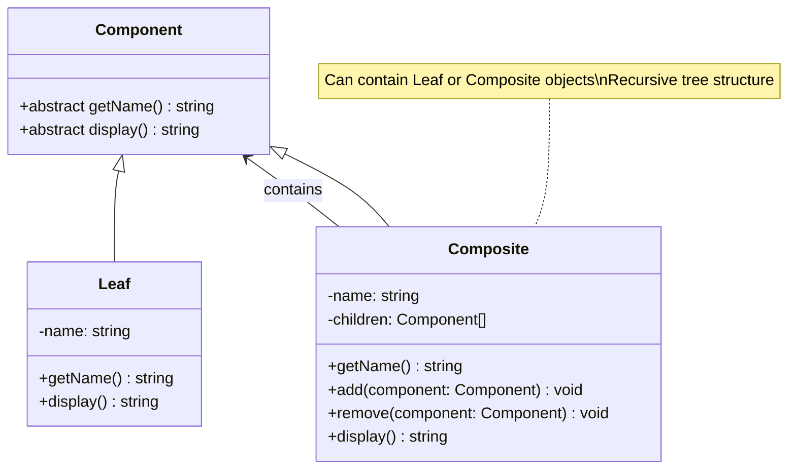

# Composite Pattern - Class Diagram

## Description
- **Component**: Interface สำหรับ leaf และ composite objects
- **Leaf**: Objects ที่ไม่มี children
- **Composite**: Objects ที่มี children และสามารถ contain leaf/composite อื่น
- Client ใช้ component interface เหมือนกันสำหรับ leaf และ composite
