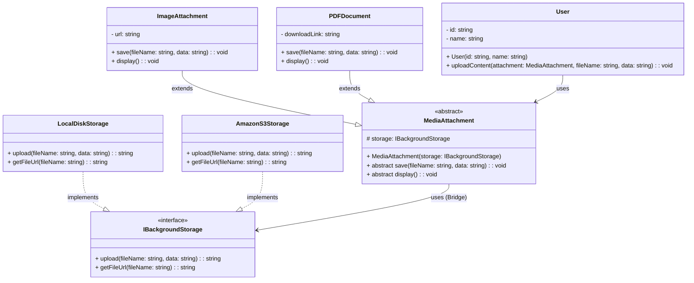

# Bridge Pattern - Class Diagram

## 📋 Pattern Overview

**Bridge** เป็น Structural Design Pattern ที่ **แยก Abstraction ออกจาก Implementation เพื่อให้ทั้งสองสามารถเปลี่ยนแปลงได้อย่างอิสระ** เหมือนการสร้างสะพานระหว่าง 2 dimension

**Real-world Use Case:** Media Attachment (รูปภาพ, PDF) สามารถเก็บที่ Local Disk หรือ AWS S3 โดยไม่ต้องสร้าง Subclass มากมาย

---

## 🎨 Class Diagram



---

## 🏗️ Component Mapping

### Implementor Interface (ฝั่ง Implementation):
- **IBackgroundStorage**
  - `upload()` - อัพโหลดไฟล์
  - `getFileUrl()` - ดึง URL

### Concrete Implementors:
- **LocalDiskStorage**
  - implements `IBackgroundStorage`
  - เก็บลงใน Local Disk (Dev Environment)
- **AmazonS3Storage**
  - implements `IBackgroundStorage`
  - เก็บลง AWS S3 (Production Environment)

### Abstraction (ฝั่ง Abstraction):
- **MediaAttachment**
  - abstract class
  - **มี Bridge:** protected `storage: IBackgroundStorage`
  - abstract methods: `save()`, `display()`
  - ไม่รู้รายละเอียดของ Storage (Decoupled)

### Refined Abstractions:
- **ImageAttachment**
  - extends `MediaAttachment`
  - กำหนด `save()`: Process Image (Resizing)
  - กำหนด `display()`: แสดงเป็น `` tag
- **PDFDocument**
  - extends `MediaAttachment`
  - กำหนด `save()`: Scan PDF for malware
  - กำหนด `display()`: แสดง Download Link

### Client:
- **User**
  - เลือก Media Type (ImageAttachment / PDFDocument)
  - เลือก Storage (LocalDiskStorage / AmazonS3Storage)
  - ทั้ง 2 ตัวเลือกอิสระต่อกัน

---

## 🔗 Relationships

| Relationship | Description |
|---|---|
| `LocalDiskStorage implements IBackgroundStorage` | Concrete Implementor |
| `AmazonS3Storage implements IBackgroundStorage` | Concrete Implementor |
| `MediaAttachment → IBackgroundStorage` | **Bridge** เชื่อม Abstraction ↔ Implementation |
| `ImageAttachment extends MediaAttachment` | Refined Abstraction |
| `PDFDocument extends MediaAttachment` | Refined Abstraction |

---

## 💡 2D Variation Without Bridge (Anti-pattern)

```
❌ WITHOUT Bridge (Explosion):
├─ ImageAttachmentLocal
├─ ImageAttachmentS3
├─ PDFDocumentLocal
├─ PDFDocumentS3
└─ VideoAttachmentLocal
   (6 classes สำหรับ 2 dimensions)

✅ WITH Bridge (Clean):
├─ ImageAttachment (+ Storage Bridge)
├─ PDFDocument (+ Storage Bridge)
└─ VideoAttachment (+ Storage Bridge)
   (3 classes + 2 Storage implementations)
```

---

## ✨ Key Characteristics

✅ **Decoupling:** Abstraction และ Implementation แยกจากกัน  
✅ **Runtime Selection:** เลือก Storage implementation ได้ตอน Runtime  
✅ **Avoid Explosion:** ไม่ต้องสร้าง Subclass สำหรับทุก Combination  
✅ **Single Responsibility:** Media Type และ Storage Type รับผิดชอบแยกกัน  
✅ **Extensibility:** เพิ่ม Media Type หรือ Storage ใหม่โดยไม่ส่งผลต่อเก่า

