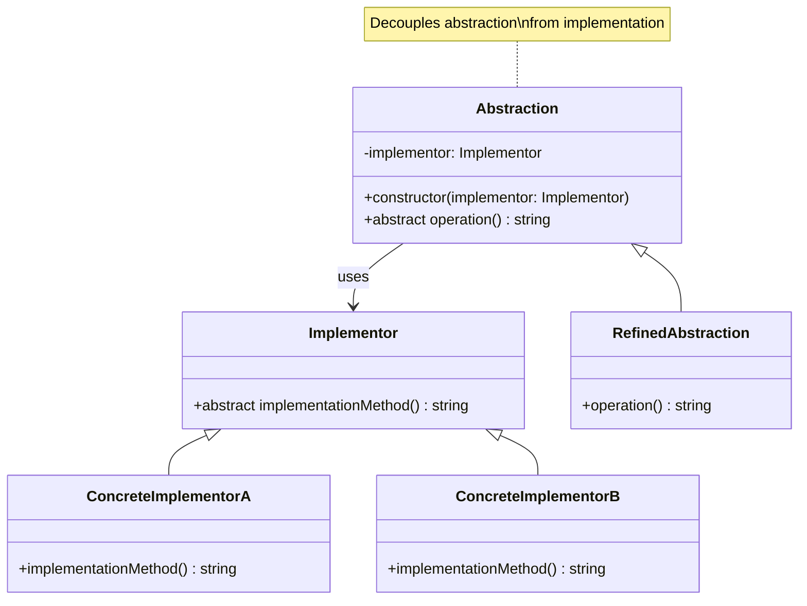

# Bridge Pattern - Class Diagram

## Description
- **Implementor**: Interface สำหรับ low-level implementation
- **ConcreteImplementors**: Concrete implementations
- **Abstraction**: High-level abstraction ที่เก็บ implementor
- **RefinedAbstraction**: Extended abstraction ด้วย features เพิ่มเติม
- Abstraction และ Implementation สามารถเปลี่ยนแปลงได้อย่างอิสระ
