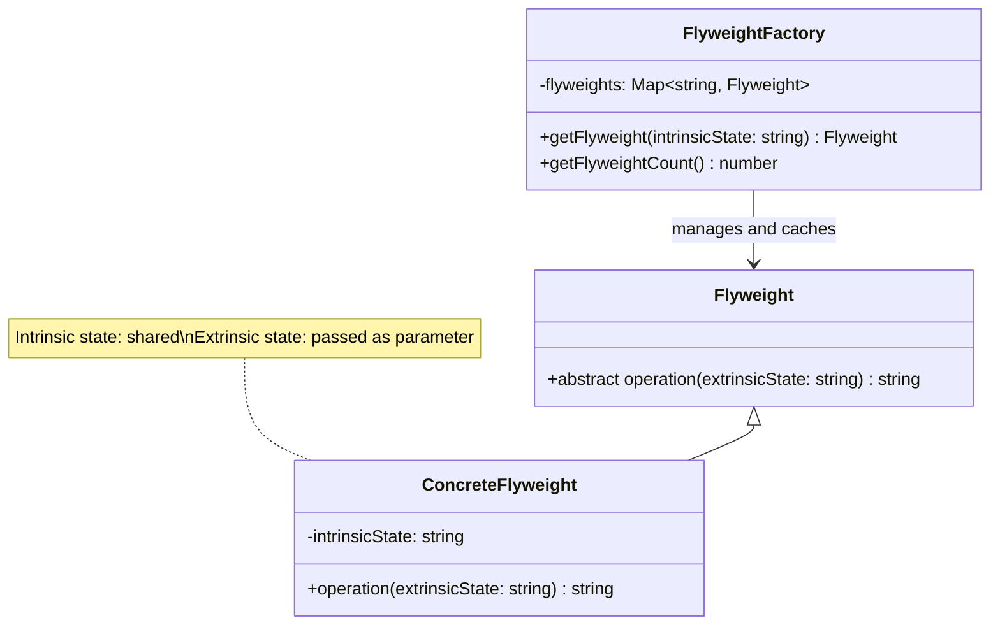

# Flyweight Pattern - Class Diagram

## Description
- **Flyweight**: Interface ที่ define operations
- **ConcreteFlyweight**: Shared objects ที่เก็บ intrinsic state
- **FlyweightFactory**: Creates และ manages flyweight objects, reuses existing ones
- Intrinsic state (shared) vs Extrinsic state (context-specific)
