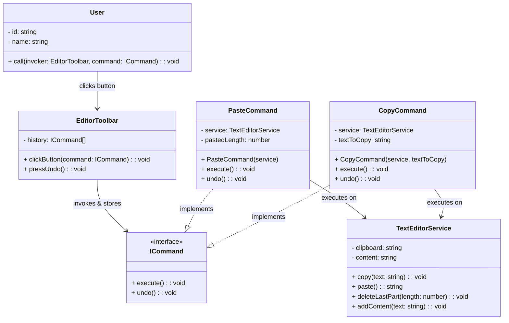

# Command Pattern - Class Diagram

## 📋 Pattern Overview

**Command** เป็น Behavioral Design Pattern ที่ **แปลงคำขอเป็นวัตถุ (Command Object) เพื่อให้สามารถส่งต่อ, เก็บประวัติ, หรือยกเลิก** เหมือนการบันทึก Command เข้า Transaction Log

**Real-world Use Case:** Editor ที่สามารถ Copy, Paste, Undo (Ctrl+Z) - เก็บประวัติ Command แล้ว undo ได้

---

## 🎨 Class Diagram



---

## 🏗️ Component Mapping

### Command Interface:
- **ICommand**
  - `execute()` - สั่งทำ
  - `undo()` - สั่งยกเลิก

### Receiver (ผู้ทำงานจริง):
- **TextEditorService**
  - `copy()`, `paste()`, `deleteLastPart()`, `addContent()`
  - ไม่รู้ว่า Command เรียก มันแค่ทำงานตามที่สั่ง

### Concrete Commands:
- **CopyCommand**
  - implements `ICommand`
  - เก็บ `service` (Receiver) และ `textToCopy`
  - `execute()` เรียก `service.copy()`
- **PasteCommand**
  - implements `ICommand`
  - เก็บ `service` และ `pastedLength` (State for undo)
  - `execute()` เรียก `service.paste()` + `addContent()`
  - `undo()` เรียก `service.deleteLastPart()`

### Invoker (ผู้สั่ง):
- **EditorToolbar**
  - ถือ `history: ICommand[]` เก็บประวัติ
  - `clickButton(command)` - execute และเก็บเข้า history
  - `pressUndo()` - ดึง command ล่าสุด แล้ว undo()

### Client:
- **User** เรียก EditorToolbar

---

## 🔗 Relationships

| Relationship | Description |
|---|---|
| `CopyCommand implements ICommand` | Concrete Command |
| `PasteCommand implements ICommand` | Concrete Command |
| `CopyCommand → TextEditorService` | Command เรียกใช้ Receiver |
| `PasteCommand → TextEditorService` | Command เรียกใช้ Receiver |
| `EditorToolbar → ICommand` | Invoker เก็บ Command |

---

## 💡 Execution & Undo Flow

```
User clicks "Paste" button
    ↓
EditorToolbar.clickButton(new PasteCommand())
    ↓
command.execute()
    ├─ service.paste()
    └─ service.addContent(text)
    ↓
history.push(command)
    ↓
User clicks "Ctrl+Z"
    ↓
EditorToolbar.pressUndo()
    ↓
lastCommand = history.pop()
    ↓
lastCommand.undo()
    ↓
service.deleteLastPart()
```

---

## ✨ Key Characteristics

✅ **Encapsulation:** Command แพ็ค Action เข้าไป  
✅ **History:** เก็บประวัติ Command ได้  
✅ **Undo/Redo:** ยกเลิก/ทำซ้ำ Command ได้  
✅ **Queue Commands:** เรียง Command ต่อ queue ได้  
✅ **Decouple:** Invoker ไม่ต้องรู้ Receiver

