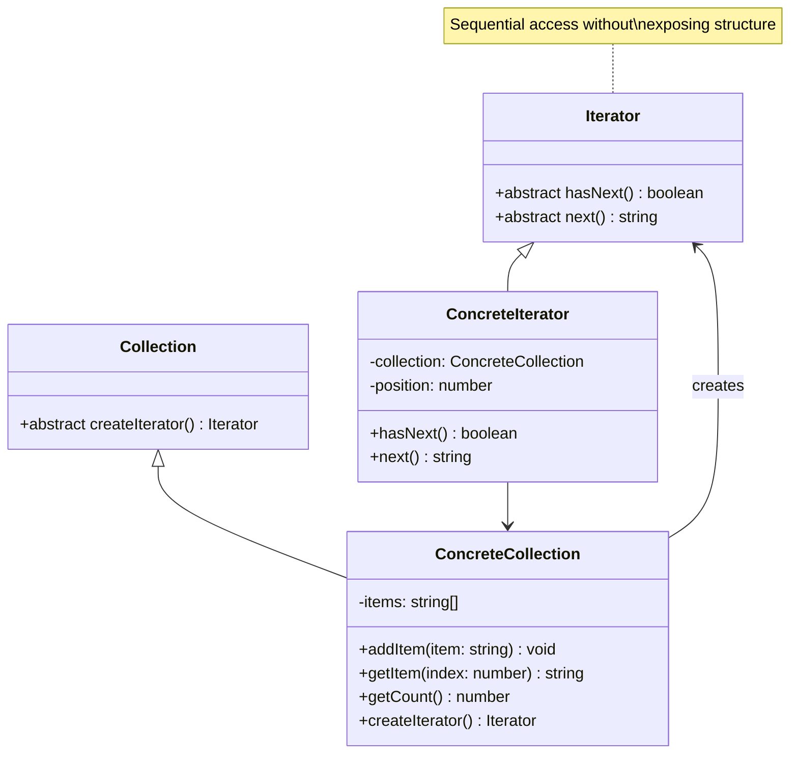

# Iterator Pattern - Class Diagram

## Description
- **Iterator**: Interface ที่ define iteration methods
- **ConcreteIterator**: Implement iterator interface
- **Collection**: Interface ที่ define createIterator method
- **ConcreteCollection**: Implement collection interface
- Client iterate ผ่าน collection โดยไม่รู้ underlying structure
