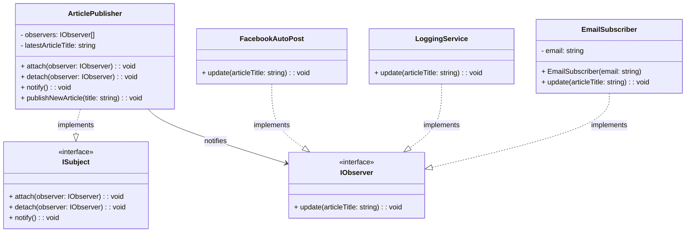

# Observer Pattern - Class Diagram

## 📋 Pattern Overview

**Observer** เป็น Behavioral Design Pattern ที่ **สร้างการติดตามแบบ One-to-Many: เมื่อ Subject เปลี่ยน สูตรจะแจ้งเตือน Observers ทั้งหมดโดยอัตโนมัติ** ใช้ Publish-Subscribe mechanism

**Real-world Use Case:** เมื่อมีบทความใหม่ - ส่ง Email, บันทึก Log, โพสต์ Facebook โดยอัตโนมัติ

---

## 🎨 Class Diagram



---

## 🏗️ Component Mapping

### Subject Interface:
- **ISubject**
  - `attach(observer)` - เพิ่มผู้ติดตาม
  - `detach(observer)` - ลบผู้ติดตาม
  - `notify()` - แจ้งเตือนทั้งหมด

### Observer Interface:
- **IObserver**
  - `update(articleTitle)` - รับข้อมูลอัปเดต

### Concrete Subject:
- **ArticlePublisher**
  - implements `ISubject`
  - เก็บ: `observers[]` (list ผู้ติดตาม)
  - เก็บ: `latestArticleTitle`
  - `attach()` / `detach()` จัดการรายชื่อ
  - `notify()` วนลูปเรียก `observer.update()` ทั้งหมด

### Concrete Observers:
- **EmailSubscriber** - ส่ง Email
- **LoggingService** - บันทึก Log
- **FacebookAutoPost** - โพสต์ Facebook

---

## 🔗 Relationships

| Relationship | Description |
|---|---|
| `ArticlePublisher implements ISubject` | Subject ทำตามสัญญา |
| `EmailSubscriber implements IObserver` | Observer ทำตามสัญญา |
| `LoggingService implements IObserver` | Observer ทำตามสัญญา |
| `FacebookAutoPost implements IObserver` | Observer ทำตามสัญญา |
| `ArticlePublisher → IObserver` | Subject เก็บ list Observer |

---

## 💡 Publish-Subscribe Flow

```
Publisher.publishNewArticle("Design Patterns 101")
    ↓
latestArticleTitle = "Design Patterns 101"
    ↓
notify()
    ├─ EmailSubscriber.update()
    │   └─ ส่ง Email: "New article: Design Patterns 101"
    │
    ├─ LoggingService.update()
    │   └─ บันทึก: "[2026-01-31] Published: Design Patterns 101"
    │
    └─ FacebookAutoPost.update()
        └─ โพสต์: "Check out: Design Patterns 101"
```

---

## ✨ Key Characteristics

✅ **Loose Coupling:** Subject ไม่รู้ Observer คือใคร  
✅ **Dynamic Registration:** Attach/Detach ได้ตลอดเวลา  
✅ **One-to-Many:** 1 Subject แจ้งเตือน Many Observers  
✅ **Automatic Notification:** เปลี่ยนแปลง → แจ้งเตือนอัตโนมัติ  
✅ **Publish-Subscribe:** ลดการ Polling (ถามซ้ำๆ)

