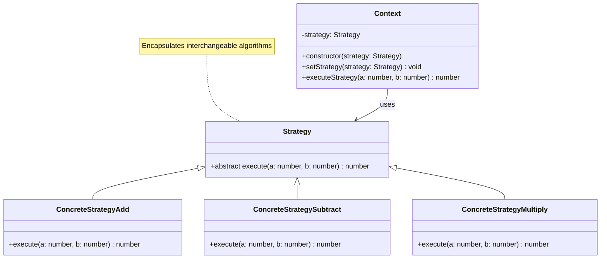

# Strategy Pattern - Class Diagram

## Description
- **Strategy**: Interface ที่ define algorithm interface
- **ConcreteStrategies**: Implement different algorithms
- **Context**: Uses strategy object เพื่อ execute algorithm
- Client สามารถเปลี่ยน strategy ได้ runtime
