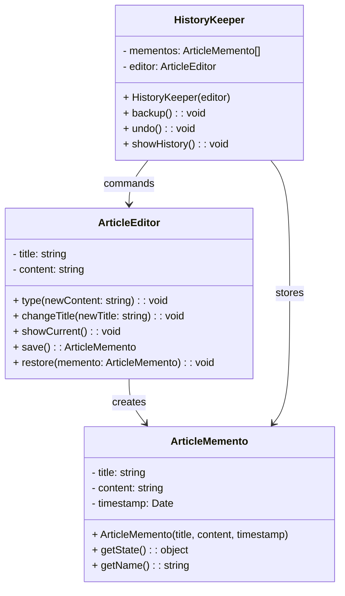

# Memento Pattern - Class Diagram

## 📋 Pattern Overview

**Memento** เป็น Behavioral Design Pattern ที่ **เก็บ Snapshot ของ State ณ เวลาหนึ่งโดยไม่เปิดเผย Internal Structure** ใช้สำหรับ Undo/Redo functionality

**Real-world Use Case:** Editor บทความ - เก็บประวัติการแก้ไข พร้อม Undo ได้

---

## 🎨 Class Diagram



---

## 🏗️ Component Mapping

### Memento (กล่องความทรงจำ):
- **ArticleMemento**
  - **Immutable** - แก้ไม่ได้
  - เก็บ: `title`, `content`, `timestamp`
  - Getter: `getState()` - อ่านสถานะ

### Originator (ตัวต้นเรื่อง):
- **ArticleEditor**
  - `type()`, `changeTitle()` - แก้ไขข้อมูล
  - `save()` - สร้าง Memento ส่งออก
  - `restore(memento)` - รับ Memento เข้ามา ทับข้อมูล

### Caretaker (ผู้เก็บรักษา):
- **HistoryKeeper**
  - ถือ `mementos[]` (ประวัติ)
  - `backup()` - สั่ง Editor save แล้วเก็บเข้าคลัง
  - `undo()` - ดึง Memento ล่าสุด ยัดกลับให้ Editor
  - `showHistory()` - แสดงประวัติ

---

## 🔗 Relationships

| Relationship | Description |
|---|---|
| `ArticleEditor → ArticleMemento` | Originator สร้าง Memento |
| `HistoryKeeper → ArticleMemento` | Caretaker เก็บ Memento |
| `HistoryKeeper → ArticleEditor` | Caretaker สั่งให้ Originator |

---

## 💡 Undo Flow

```
Step 1: User types "Hello World"
    ArticleEditor.type("Hello World")
    
Step 2: User clicks Save/Backup
    HistoryKeeper.backup()
        ├─ editor.save() → ArticleMemento
        └─ mementos.push(memento)

Step 3: User types " and more"
    ArticleEditor.type(" and more")
    
Step 4: User clicks Undo (Ctrl+Z)
    HistoryKeeper.undo()
        ├─ memento = mementos.pop()
        └─ editor.restore(memento)
            └─ content = "Hello World" (back to step 2)
```

---

## ✨ Key Characteristics

✅ **Encapsulation:** ไม่เปิดเผย Internal State  
✅ **Immutable Snapshot:** Memento ไม่สามารถแก้ไข  
✅ **Separation of Concerns:** Originator, Caretaker, Memento แยกหน้าที่  
✅ **History Management:** เก็บ Snapshot หลายตัวได้  
✅ **Undo/Redo:** สนับสนุน Undo/Redo functionality

