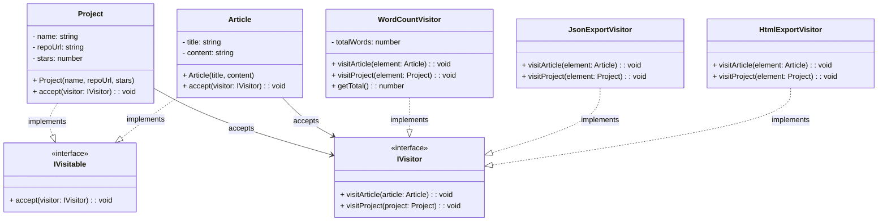

# Visitor Pattern - Class Diagram

## 📋 Pattern Overview

**Visitor** เป็น Behavioral Design Pattern ที่ **แยก Algorithm ออกจาก Object Structure โดยสร้าง Visitor ที่ "เยี่ยม" object ต่างๆ** ช่วยให้เพิ่ม Operation ใหม่ได้ง่ายโดยไม่แก้ Object

**Real-world Use Case:** Export Content (Article/Project) เป็น HTML, JSON, หรือ Word Count โดยไม่แก้ Article/Project class

---

## 🎨 Class Diagram



---

## 🏗️ Component Mapping

### Visitor Interface:
- **IVisitor**
  - `visitArticle(article)` - ประมวลผล Article
  - `visitProject(project)` - ประมวลผล Project
  - **Double Dispatch:** Method Overloading เพื่อแยก Type

### Visitable Interface (Element):
- **IVisitable**
  - `accept(visitor)` - ยอมรับให้ Visitor มา

### Concrete Elements (Object Structure):
- **Article**
  - `accept()` เรียก `visitor.visitArticle(this)`
- **Project**
  - `accept()` เรียก `visitor.visitProject(this)`

### Concrete Visitors (Algorithm):
- **HtmlExportVisitor**
  - `visitArticle()` - export Article → HTML
  - `visitProject()` - export Project → HTML
- **JsonExportVisitor**
  - `visitArticle()` - export Article → JSON
  - `visitProject()` - export Project → JSON
- **WordCountVisitor**
  - `visitArticle()` - นับคำใน Article
  - `visitProject()` - return 0 (metadata)
  - `getTotal()` - รวมคำทั้งหมด

---

## 🔗 Relationships

| Relationship | Description |
|---|---|
| `Article implements IVisitable` | Element ยอมรับ Visitor |
| `Project implements IVisitable` | Element ยอมรับ Visitor |
| `HtmlExportVisitor implements IVisitor` | Concrete Visitor |
| `JsonExportVisitor implements IVisitor` | Concrete Visitor |
| `WordCountVisitor implements IVisitor` | Concrete Visitor |
| `Article → IVisitor` | Element accept Visitor |
| `Project → IVisitor` | Element accept Visitor |

---

## 💡 Double Dispatch Flow

```
contentList.forEach(item → item.accept(visitor))

Article.accept(htmlExporter)
    ├─ visitor.visitArticle(this)
    └─ "Export as HTML"

Project.accept(htmlExporter)
    ├─ visitor.visitProject(this)
    └─ "Export as HTML (different)"

---

contentList.forEach(item → item.accept(visitor))

Article.accept(wordCounter)
    ├─ visitor.visitArticle(this)
    └─ "Count words"

Project.accept(wordCounter)
    ├─ visitor.visitProject(this)
    └─ "0 words (metadata)"
```

---

## ✨ Key Characteristics

✅ **Operation Separation:** Algorithm แยกจาก Object  
✅ **Easy Extension:** เพิ่ม Visitor ใหม่ ไม่แก้ Element  
✅ **Double Dispatch:** Type checking ผ่าน Overloading  
✅ **Many Operations:** 1 Object Structure + Many Visitors  
✅ **Data Structure Fixed:** Element structure ไม่เปลี่ยน Operation ไม่จำกัด

