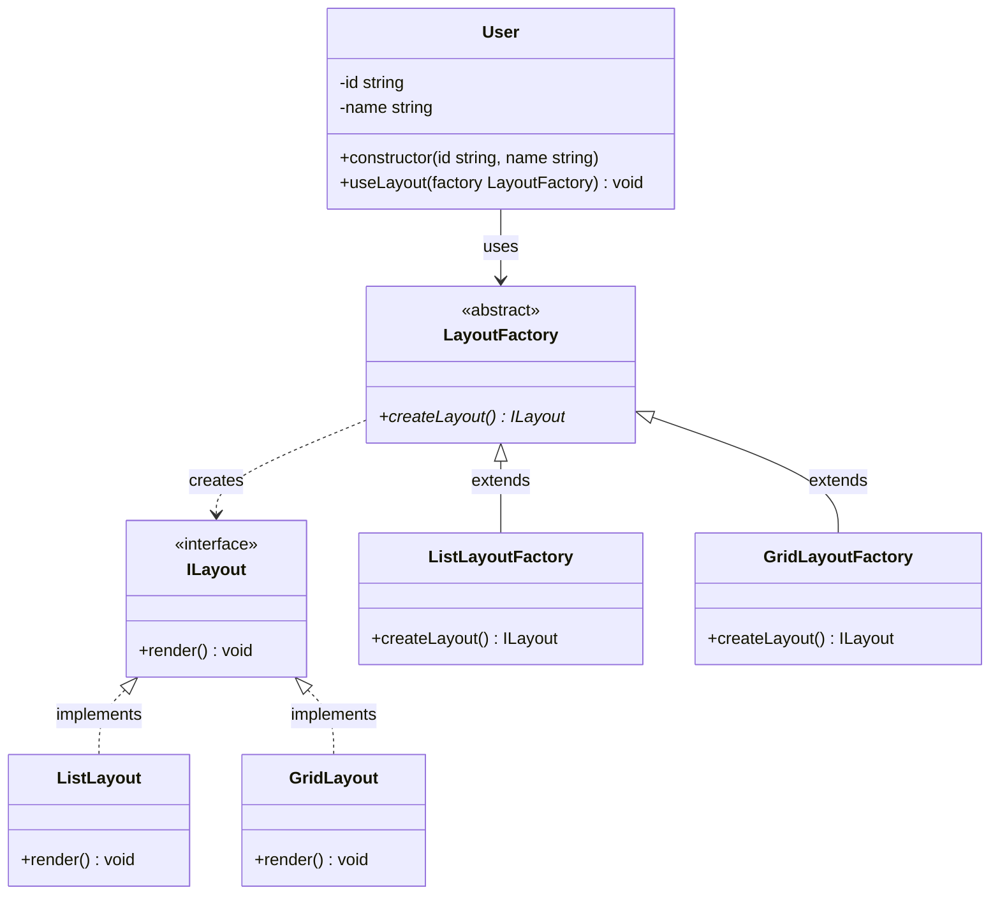

## Factory Method Pattern Components
- Client:User
- Creator:LayoutFactory
- Concrete Creators:ListLayoutFactory, GridLayoutFactory
- Product:ILayout
- Concrete Products:ListLayout, GridLayout

## Planning in the future scale
- ตอนนี้เรามี Layout เเค่ 2 แบบ List กับ Grid เเต่ถ้าในอนาคต เราอยากเพิ่ม Layout ใหม่ เช่น Masonry Layout หรือ Carousel Layout เราเเค่สร้าง Concrete Creator เเละ Concrete Product ใหม่ โดยไม่ต้องไปยุ่งกับโค้ดเดิมของ Client หรือ Creator อื่นๆ

## Crucial Part of Code

- จะได้ Layout อะไรขึ้นอยู่กับว่าเราใช้ Factory อะไรในการสร้าง เพื่อใช้คุณสมบัติเเบบ Polymorphism
```ts
    createLayout(): ILayout {
        return new SomeLayout();
    }
```

- หลังจากสร้าง Factory เเล้ว Client ก็สามารถใช้ Factory นั้นเพื่อสร้าง Layout เเละเรียกใช้เมธอด render จะได้ Layout อะไรก็ขึ้นอยู่กับ Factory ที่ส่งเข้าไป เช่น new ListLayoutFactory() หรือ new GridLayoutFactory() จะได้ List หรือ Grid ก็ขึ้อยู่กับตรงนี้
```ts
    useLayout(factory: LayoutFactory): void {
        console.log(`👤 ${this.name} uses layout`);
        const layout = factory.createLayout();
        layout.render();
    }
```
