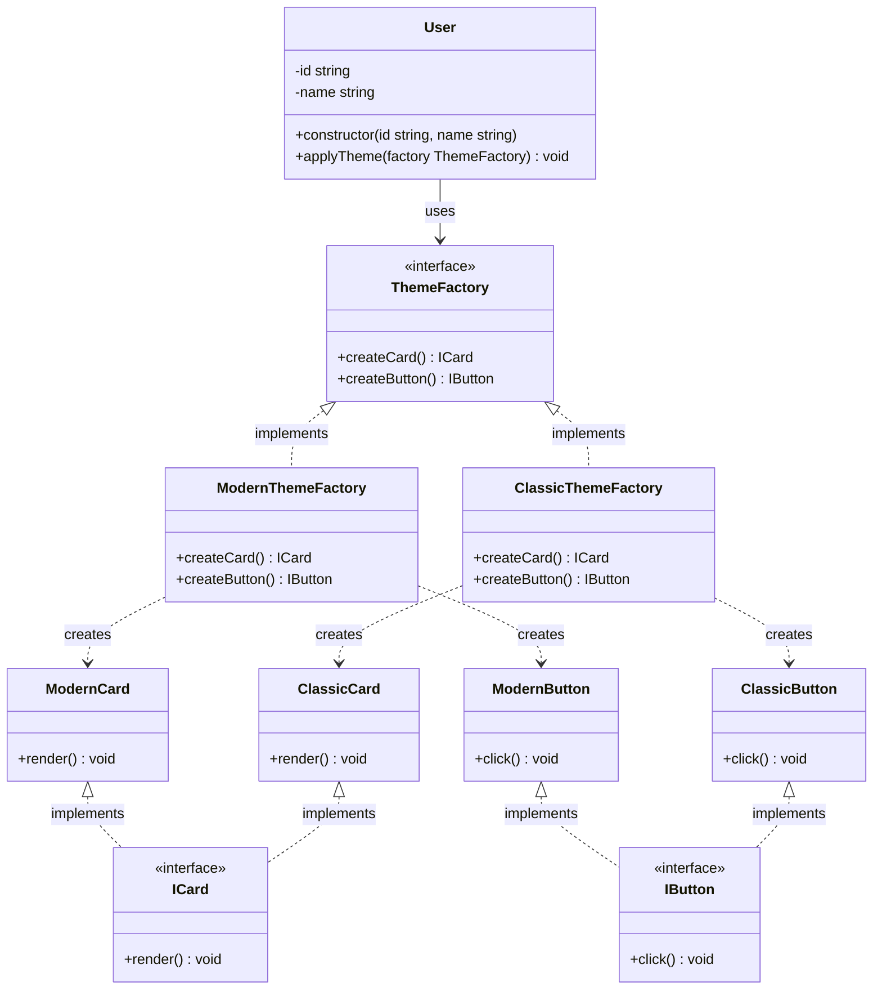

## Table of Relation
| component/web style | modern       | classic       |
| ------------------- | ------------ | ------------- |
| card                | ModernCard   | ClassicCard   |
| button              | ModernButton | ClassicButton |

## Abstract Factory Component
- Product: ICard,IButton
- Concrete: ModernCard,ModernButton,ClassicCard,ClassicButton
- Factory: ThemeFactory
- Concrete Factory: ModernThemeFactory,ClassicThemeFactory
- Client: User

## Crucial Part of Code

- User ใช้ Abstract Factory ในการสร้าง families of related objects (Card เเละ Button) โดยไม่ต้องระบุคลาสที่เเน่นอนของวัตถุที่ถูกสร้างขึ้น จะได้ UI components ที่สอดคล้องกับ theme ที่เลือก 

```ts
applyTheme(factory: ThemeFactory): void {
        console.log(`👤 ${this.name} applies theme`);
        const card = factory.createCard();
        const button = factory.createButton();

        card.render();
        button.click();
}
```
- จะได้ Card เเบบไหน ขึ้นอยู่กับว่าเราใช้ Factory อะไรในการสร้าง
```ts
createCard(): ICard { return new SomeConcreteCreator(); }
```

## Planning in the future scale
- ตอนนี้เรามีเเค่ 2 theme คือ modern เเละ classic ถ้าในอนาคต เราอยากเพิ่ม theme ใหม่ เช่น Dark Theme หรือ Light Theme เราเเค่สร้าง Concrete Factory เเละ Concrete Products ใหม่ โดยไม่ต้องไปยุ่งกับโค้ดเดิมของ Client หรือ Factory อื่นๆ
- เ**เผนอื่นๆ ที่จะประยุกต์ใช้ abstract factory pattern**
    - Theme กับ UI Components (DarkCard, LightButton, RenbolModal) เปลี่ยนเเค่ Theme ไม่ได้เปลี่ยนจากไอเดียเดิมก่อนนี้
    - Language กับ Font style (EnglishStyle1, ThaiStyle2, JapaneseStyle3) เปลี่ยนเเค่ Language ไม่ได้เปลี่ยนจากไอเดียเดิมก่อนนี้ ถึงเราจะเปลี่ยนเเค่ Language เเต่ Font style ก็ยังคงสอดคล้องกับ Language นั้นๆ หรือถ้าเปลี่ยน Font style ก็ยังคงสอดคล้องกับ Language ที่เลือก
    - เคยคิดเล่นๆ ตอนนั้น ไม่รู้อยากประยุกต์ใช้ abstract factory pattern กับอะไรดีเเต่มีไอเดีย คือ ENV with Building มันคือการประยุกต์ใช้การสร้าง Building ใน ENV ต่างๆ เช่น

      - บ้านบนฟ้า,บ้านใต้ดิน,บ้านบนดวงจันทร์,บ้านในน้ำ,บ้านบนต้นไม้,บ้านในทะเลทราย,บ้านในป่า,บ้านในหิมะ,บ้านบนอวกาศ
      - โรงเเรมบนฟ้า,โรงเเรมใต้ดิน,โรงเเรมบนดวงจันทร์,โรงเเรมในน้ำ,โรงเเรมบนต้นไม้,โรงเเรมในทะเลทราย,โรงเเรมในป่า,โรงเเรมในหิมะ,โรงเเรมบนอวกาศ
      - โรงพยาบาลบนฟ้า,โรงพยาบาลใต้ดิน,โรงพยาบาลบนดวงจันทร์,โรงพยาบาลในน้ำ,โรงพยาบาลบนต้นไม้,โรงพยาบาลในทะเลทราย,โรงพยาบาลในป่า,โรงพยาบาลในหิมะ,โรงพยาบาลบนอวกาศ
      - สุสานบนฟ้า,สุสานใต้ดิน,สุสานบนดวงจันทร์,สุสานในน้ำ,สุสานบนต้นไม้,สุสานในทะเลทราย,สุสานในป่า,สุสานในหิมะ,สุสานบนอวกาศ