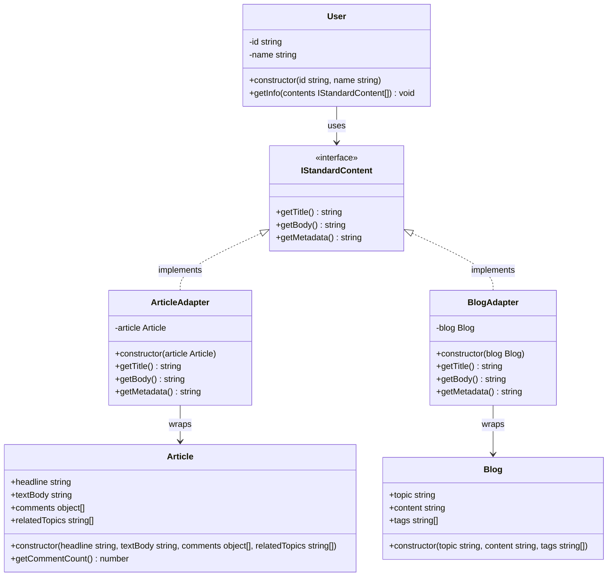

## Adapter Pattern Component
- Target: IStandardContent
- Adaptee: Article, Blog
- Adapter: ArticleAdapter, BlogAdapter
- Client: User

```ts
    private article: Article;
    
    constructor(article: Article) {
        this.article = article;
    }
    getTitle(): string {
        return this.article.headline;
    }

    getBody(): string {
        return this.article.textBody;
    }

    getAuthor(): string {
        return this.article.author;
    }

    getSummary(): string {
        return this.article.textBody.slice(0, 80).trim() + "...";
    }

    getTags(): string[] {
        return this.article.relatedTopics;
    }

    getMetadata(): string {
        return `Comments: ${this.article.getCommentCount()} | Published: ${this.article.publishedAt.toDateString()}`;
    }
```