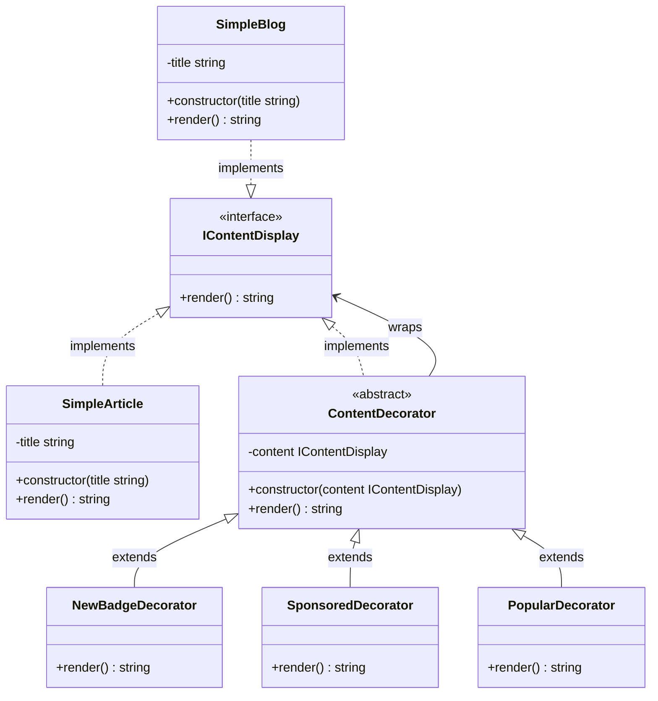

## Decorator Component
- Component: IContentDisplay
- Concrete Component: SimpleArticle
- Decorator: ContentDecorator
- Concrete Decorators: NewBadgeDecorator, SponsoredDecorator
- Client: myPost

```ts
    // base decorator
     render(): string {
        return this.content.render();
    }
    // concrete decorators
    render(): string {
        return `[NEW!] ${super.render()}`;
    }
```

## Planning Scale in the Future
- เพิ่ม New Content ที่ต่างกัน เเล้วใช้ Adapter จัดการให้เข้ากับระบบ เเล้วให้ Decorator ห่อหุ้มต่อ
- เพิ่มการเเสดงผลที่ต่างกัน เช่น เเสดงผลเป็นวิดีโอ, รูปภาพ, ข้อความธรรมดา โดยใช้ Bridge Pattern ร่วมกับ Decorator Pattern
  